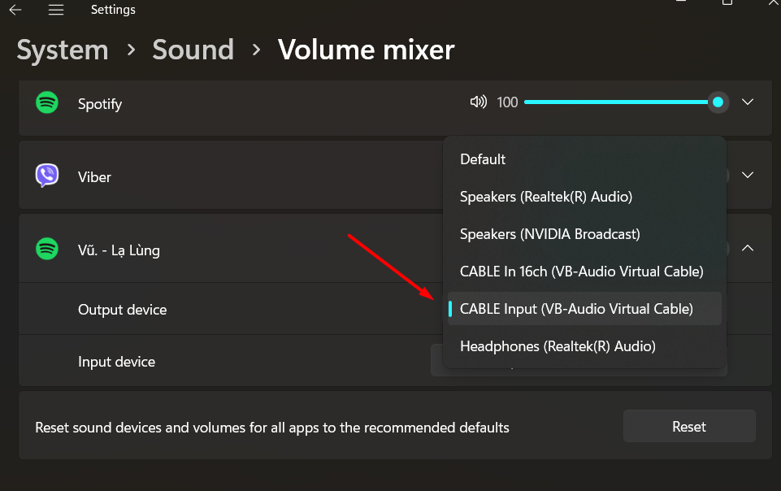

# Spotify Discord Streamer

Stream your Spotify music directly to Discord voice channels. This bot allows you to share your Spotify music with friends in Discord voice channels in real-time.

## Overview

This Discord bot integrates with Spotify to stream your music directly to Discord voice channels. Perfect for sharing music with friends or creating a collaborative listening experience in your Discord server.

### Key Features

- 🎵 Real-time Spotify streaming to Discord
- 🎮 Simple command interface
- 📱 Full playback control
- 📋 Queue management
- 🔀 Shuffle mode support
- ⚡ Easy setup and configuration

[Getting Started](#installation) • [Commands](#usage) • [Configuration](#spotify-configuration)

## Inspired by

- [Discord-Music-Bot](https://github.com/LordBip/Discord-Music-Bot)

## Features

- Stream music from Spotify
- Music playback controls (play, pause, skip, previous)
- Music queue management
- Shuffle mode
- Easy to configure

## Requirements

- Node.js (v16.0.0 or higher)
- Discord Bot Token
- Spotify Developer Account
- VB-Cable Virtual Audio Device

## Installation

1. Clone this repository:
```bash
git clone https://github.com/your-username/discord-music-bot.git`
```
```bash
cd discord-music-bot
```

2. Install dependencies:

```bash
npm install
```

3. Install VB-Cable Virtual Audio Device:
   - Download from [VB-Cable Website](https://vb-audio.com/Cable/)
   - Install and restart your computer

4. Configure the bot:
   - Update the configuration in `config.js`:
     - `DISCORD_TOKEN`: Your Discord bot token
     - `DISCORD_CHANNEL_ID`: Voice channel ID
     - `SPOTIFY_CLIENT_ID`: Client ID from Spotify Developer Dashboard
     - `SPOTIFY_CLIENT_SECRET`: Client Secret from Spotify Developer Dashboard

## Usage

1. Start spotify authentication:

```bash
node spotify-auth-server.js
```
2. Start the bot:

```bash
node MusicBot_no_delay_command.js
```
3. Play music from Spotify:

Open your Spotify app and play any song. The bot will stream the song to your Discord voice channel.

4. Change Spotify output to VB-Cable:

In Windows Search bar, search for "Sound mixer options",change Spotify output to CABLE Input.



2. Available commands:
   - `;help` - View command list
   - `;join` - Connect bot to voice channel
   - `;play <song name or link>` - Play music
   - `;pause` - Pause current track
   - `;resume` - Resume playback
   - `;skip` - Skip to next track
   - `;previous` - Go to previous track
   - `;queue <song name or link>` - Add to queue
   - `;status` - Check bot status
   - `;shuffle` - Toggle shuffle mode

## Spotify Configuration

1. Visit [Spotify Developer Dashboard](https://developer.spotify.com/dashboard)
2. Create a new application
3. Add `http://localhost:8888/callback` to Redirect URIs
4. Get Client ID and Client Secret from dashboard
5. Update information in `config.js`

## Important Notes

- Bot requires Spotify Premium account for full functionality
- Ensure VB-Cable is properly installed and configured
- Bot needs Administrator permissions in Discord server

